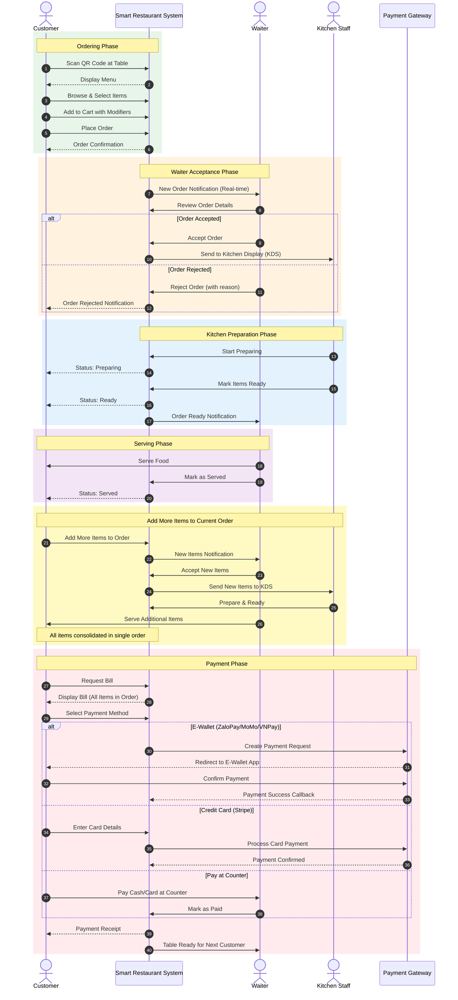
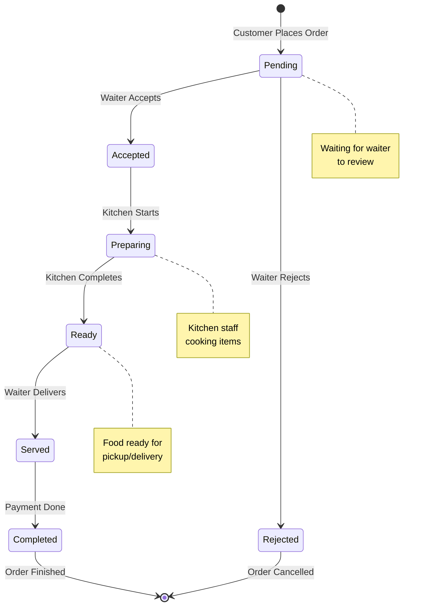

# Smart Restaurant - Project Description

## System Overview

**Smart Restaurant** is a QR-based menu ordering system for **dine-in service** that enables restaurants to:
- Manage digital menus with categories, items, and modifiers
- Generate unique QR codes for each table
- Allow customers to scan QR, browse menu, and place orders from their phones
- Customers can add items to their current order during their visit (single order per table session)
- Process payments after the meal via payment gateway integration (ZaloPay, MoMo, VNPay, Stripe, etc.) - pay-after-meal model
- Track orders in real-time via Kitchen Display System (KDS)
- View analytics and performance reports

## Technology Stack

| Layer | Technology |
| :---- | :---- |
| **Architecture** | Single Page Application (SPA) |
| **Frontend** | ReactJS / NextJS |
| **Backend** | NodeJS with Express/similar framework |
| **Database** | SQL or NoSQL database |
| **Authentication** | Passport.js with JWT |
| **Payment** | Payment Gateway (ZaloPay, MoMo, VNPay, Stripe, etc.) |
| **Real-time** | Socket.IO / WebSocket |
| **Caching** | Redis (optional) |
| **Hosting** | Public hosting service |

## Key User Flows

### 1. Restaurant Setup (Admin)
```
Super Admin creates Admin account → Admin login → Menu Creation → Table Setup → QR Generation
```

### 2. Customer Registration
```
Sign up → Email Verification → Login → Access order history and preferences
```

### 3. Customer Ordering (Dine-in Only)
```
Scan QR → View Menu → Add to Cart → Customize with Modifiers → Submit Items → Track Order → Add More Items → Request Bill → Payment
```
**Note:** Customers can add more items to their current unpaid order at any time. All items are consolidated into a single order per table session.

### 4. Waiter Order Acceptance
```
Customer Places Order → Waiter Receives Notification → Waiter Reviews Order → Accept/Reject → Send to Kitchen
```

### 5. Order Processing (Kitchen)
```
Waiter Accepts Order → Kitchen Receives → Preparing → Ready → Waiter Serves → Completed
```

### Main Flow Diagram (Mermaid)



### Order State Diagram (Mermaid)



## User Roles

| Role | Description |
| :---- | :---- |
| **Guest** | Customer who scans QR code to browse menu and place orders |
| **Customer** | Registered user with order history and saved preferences (can sign up) |
| **Super Admin** | System administrator who creates and manages Admin accounts |
| **Admin** | Restaurant owner with full access to restaurant features (created by Super Admin) |
| **Waiter** | Accepts customer orders, serves food, manages table service (created by Admin) |
| **Kitchen Staff** | Access to KDS for order preparation (created by Admin) |

## Account Management Flow

```
Super Admin → Creates Admin accounts → Admin manages their restaurant
                                     → Admin creates Waiter accounts
                                     → Admin creates Kitchen Staff accounts
Customer → Self sign-up via registration form
```

**Note:** This is a single-restaurant system. Multi-tenant support for multiple restaurants is not included in this version.

## Core Features

### Customer-Facing (Dine-in)
- QR code menu access (table-linked)
- Menu browsing with filters and search
- Shopping cart with modifiers
- Add items to current order (single order per table session)
- Real-time order tracking
- Request bill when ready
- Pay after meal (ZaloPay, MoMo, VNPay, Stripe, etc.)
- Item reviews

### Super Admin
- Create and manage Admin accounts
- System-level configuration

### Waiter
- Receive real-time notifications for new orders
- View pending orders by table
- Accept or reject order items
- Send accepted orders to kitchen
- Mark orders as served
- View assigned tables

### Restaurant Admin (Owner)
- Menu management (categories, items, modifiers)
- Table and QR code management
- Order management with KDS
- Revenue reports and analytics
- Create Waiter and Kitchen Staff accounts

### Advanced
- Kitchen Display System (KDS) with timers
- Real-time WebSocket updates
- Fuzzy search for menu items
- Multi-language support (EN/VI)
- Redis caching
- Docker containerization
- CI/CD pipeline
